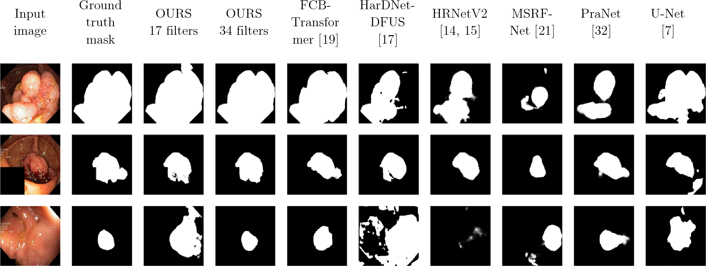

# Using DUCK-Net for polyp image segmentation


## Installation

Our implementation has been tested and run on ```Python 3.10``` using the libraries from ```requirements.txt```. 

To install the libraries you can run the command:

```
pip install -r requirements.txt
```

NOTE: You should be able to use slightly different versions for the libraries than the ones we used as long as they are compatible with one another. 


## Running the project

The project can be run using Jupyter Notebook on the file ```ModelNotebook.ipynb```.

## Data-Sets

The randomly split datasets we tested the models on are publicly available [here](https://drive.google.com/drive/folders/1kg9XImzrd9PpTtleQSz6l8uq82LV1sjV?usp=share_link). 

The datasets used in this study are publicly available at: 
- Kvasir-SEG: [here](https://datasets.simula.no/kvasir-seg/). 


### Kvasir

Method | DSC | Jaccard | Precision | Recall | Accuracy
--- | --- | --- | --- |--- |---
U-Net (with our augmentations) | 0.8655 | 0.7629 | 0.8593 | 0.8718 | 0.9563
HRNetV2 | 0.8530 | 0.7438 | 0.8778 | 0.8297 | 0.9539
PraNet (pre-trained) | 0.9094 | 0.8339 | 0.9599 | 0.8640 | 0.9738
HarDNet-DFUS (pre-trained) | 0.8626 | 0.7584 | 0.9351 | 0.8005 | 0.9583
MSRF-Net | 0.8508 | 0.7404 | 0.8993 | 0.8074 | 0.9543
FCN-Transformer (pre-trained) | 0.9220 | 0.8554 | 0.9238 | 0.9203 | 0.9749
OURS (no pre-training, 17 filters) | 0.9343 | 0.8769 | 0.9350 | 0.9337 | 0.9789
OURS (no pre-training, 34 filters) | **0.9502** | **0.9051** | **0.9628** | **0.9379** | **0.9842**
Standard Deviation (between methods) | 0.0373 | 0.0615 | 0.0349 | 0.0519 | 0.0115


## Qualitative Results

An example of qualitative results can be seen below:




